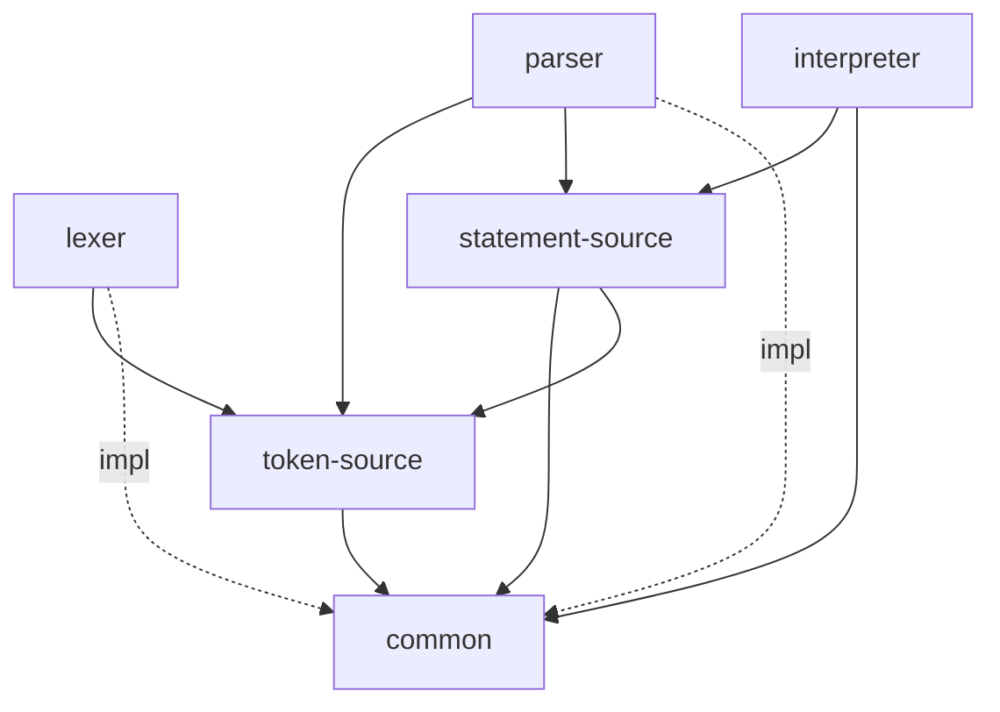

# PrintScript

Implementación de **PrintScript 1.0**, 

Todo el pipeline es **lazy / streaming**: nunca se carga el programa entero en memoria. Cada etapa produce sus resultados de a uno por vez y bajo demanda.

## Pipeline

```
código fuente
   │
   ▼
 Lexer ──────────▶ TokenSource ──────────▶ Parser ──────────▶ StatementSource ──────────▶ Interpreter ──────────▶ ProgramOutput
 (scanning)        (contrato)              (recursive         (contrato)                  (tree-walking)          (salida)
                                            descent)
```

Cada flecha de contrato (`TokenSource`, `StatementSource`) es una **interfaz perezosa**: el consumidor pide el siguiente elemento (`nextToken()` / `nextStatement()`) y recién ahí se produce. El parser no conoce al lexer concreto, y el interpreter no conoce al parser: cada uno depende solo del contrato.

## Módulos y dependencias



| Módulo | Rol | Depende de |
|---|---|---|
| `common` | Modelo de dominio compartido: AST + posiciones de código. Es el *kernel* del que dependen todos. | — |
| `token-source` | **Contrato** lexer → parser: `Token`, `TokenSource`, `TokenReadResult`. | `common` |
| `statement-source` | **Contrato** parser → interpreter: `StatementSource`, `StatementReadResult`, `ParseError`. | `common`, `token-source` |
| `lexer` | Convierte texto en tokens. Implementa `TokenSource`. | `token-source` (`common` interno) |
| `parser` | Convierte tokens en sentencias (AST). Implementa `StatementSource`. | `token-source`, `statement-source` (`common` interno) |
| `interpreter` | Ejecuta las sentencias y produce la salida. | `statement-source`, `common` |

Regla aplicada para `api` vs `implementation`: una dependencia es `api` **solo si el módulo expone sus tipos en su propia API pública** (p. ej. el parser recibe un `TokenSource` y devuelve un `StatementSource`, así que ambos son `api`). Si el módulo la usa solo internamente, es `implementation` (p. ej. el parser usa el AST de `common` por dentro, pero lo re-exporta `statement-source`, así que para el parser `common` es `implementation`).

## Cómo se resolvió cada módulo (patrones)

### `common`
Modelo de dominio puro, sin lógica.
- **Composite** para el AST: `Node` → `Statement` / `Expression`, jerarquías **sealed** para que los `when` sean exhaustivos (el compilador obliga a contemplar cada caso nuevo).
- **Value Objects** para posiciones: `SourcePosition` (fila/columna) y `SourceSpan` (inicio + fin), que permiten reportar errores con ubicación exacta.

### `token-source` y `statement-source` (módulos de contrato)
- **Ports & Adapters**: son las *interfaces* (puertos) que desacoplan las implementaciones. El lexer/parser son adaptadores que las implementan; el parser/interpreter son clientes que las consumen.
- **Iterator perezoso**: `nextToken()` / `nextStatement()` entregan un elemento por vez.
- **Result** (sin excepciones): `TokenReadResult` (`Success`/`Failure`) y `StatementReadResult` (`Success`/`Failure`/`EndOfInput`). Los errores viajan como valores.

### `lexer`
Produce tokens escaneando el texto carácter por carácter.
- **Strategy**: un `TokenScanner` por categoría de lexema — `IdentifierOrKeywordScanner`, `NumberLiteralScanner`, `StringLiteralScanner`, `SymbolScanner`.
- **Chain of Responsibility / Dispatcher**: `TokenScannerDispatcher` prueba los scanners y delega en el que puede reconocer el carácter actual.
- **Cursor + streaming**: `ReaderCharacterCursor` lee del input sin cargarlo entero; `ScanningTokenSource` implementa `TokenSource` de forma perezosa.
- **Factory**: `PrintScriptLexerFactory` arma el lexer con su versión de lexemas (`PrintScriptV1Lexemes`), lo que deja lugar para una v2 sin tocar el resto.

### `parser`
Convierte tokens en sentencias mediante **recursive descent**.
- **Strategy + Dispatcher con lookahead (LL(k))**: `StatementParserDispatcher` le pregunta a cada `StatementParser` (`DeclarationParser`, `AssignmentParser`, `PrintlnParser`) si hace `match` mirando los próximos tokens (`peek`/`peekAt`), sin consumir. Esto resuelve que `assignment` y una futura `call` empiecen igual (ambos con `IDENTIFIER`): se distinguen por el 2º token.
- **Recursive descent por niveles de precedencia** para expresiones: una clase por nivel (`LeftAssociativeBinaryExpressionParser` para aditivo y multiplicativo, `UnaryExpressionParser`, `PrimaryExpressionParser`), encadenadas de menor a mayor precedencia. La asociatividad izquierda se logra con un bucle dentro del nivel.
- **`checkGrammar` / `build`**: cada sub-parser separa la validación gramatical (consumir tokens esperados) de la construcción del nodo AST. El helper `orReturn` corta ante el primer error.
- **Streaming + fail-fast**: `ParsingStatementSource` parsea una sentencia por llamada. Ante el primer error devuelve `Failure` y **queda terminal** (toda llamada posterior devuelve `EndOfInput`): se reporta el primer error y se corta, no se acumulan errores.

### `interpreter`
Ejecuta el AST (**tree-walking interpreter**).
- **Strategy**: un `StatementExecutor` por tipo de sentencia (`DeclarationExecutor`, `AssignmentExecutor`, `PrintlnExecutor`), despachados por `StatementExecutorDispatcher`.
- **Registry + Strategy** para operadores: `BinaryOperationRegistry` mapea cada `BinaryOperator` a su `BinaryOperation` (`Add`, `Subtract`, `Multiply`, `Divide`). Agregar un operador = una clase + una entrada.
- **Template Method**: `ArithmeticOperation` valida que ambos operandos sean números y delega el cálculo concreto en la subclase. `AddOperation` es aparte porque además maneja concatenación (`string + x`).
- **Context object**: `ExecutionContext` le da a los executors lo que necesitan (`environment`, `evaluate`, `emit`) sin acoplarlos al `Interpreter` concreto.
- **Result**: `ExecutionResult` (con `SemanticError` posicionado) e `InterpretationResult` (distingue `ParseFailure` de `SemanticFailure`).
- **Factory**: `PrintScriptInterpreterFactory` arma el interpreter con su `Environment` y su `ProgramOutput`.

## Gramática (PrintScript 1.0)

Sentencias:

```ebnf
program     = { statement } ;

statement   = declaration
            | assignment
            | println ;

declaration = "let" IDENTIFIER ":" type [ "=" expression ] ";" ;
assignment  = IDENTIFIER "=" expression ";" ;
println     = "println" "(" expression ")" ";" ;

type        = "number" | "string" ;
```

Expresiones (ordenadas de menor a mayor precedencia; los binarios son asociativos a izquierda):

```ebnf
expression     = additive ;
additive       = multiplicative { ( "+" | "-" ) multiplicative } ;
multiplicative = unary { ( "*" | "/" ) unary } ;
unary          = ( "+" | "-" ) unary
               | primary ;
primary        = NUMBER_LITERAL
               | STRING_LITERAL
               | IDENTIFIER
               | "(" expression ")" ;
```

Terminales (tokens): `let`, `println`, `number`, `string`, identificadores, literales numéricos, literales de string (comillas simples o dobles), `+ - * /`, `=`, `:`, `;`, `( )` y `EOF`.

Reglas semánticas que aplica el interpreter: una variable debe declararse antes de usarse/asignarse; chequeo de tipos en la inicialización y en la asignación; `number + number` es suma y `string + x` es concatenación; división por cero y unario sobre no-número son errores.

### Ejemplo

```typescript
let name: string = "world";
let count: number = 2 + 3 * 4;
println("hello " + name);
println(count);
```

Salida:

```
hello world
14
```

## Build & Test

```bash
./gradlew build   # compila y corre todos los tests
./gradlew test    # solo tests
```

La configuración de build común (toolchain de Java 21, JUnit, dependencias de test) vive en un **convention plugin** (`buildSrc/src/main/kotlin/printscript.kotlin-library.gradle.kts`), así cada módulo solo declara `plugins { id("printscript.kotlin-library") }` y sus dependencias, sin repetir boilerplate.
